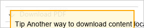

> [**Tell us about your PDF
> experience.**](https://aka.ms/learn-pdf-feedback)

# What is the Microsoft Help Viewer?

> 10/02/2025
>
> You can use Microsoft Help Viewer to install, view, and manage local
> documentation installs for Microsoft products and technologies on
> local computers. These products include Visual Studio,
>
> .NET, language reference, SQL Server, and Windows development. With
> Help Viewer, you, and any users you support, can:

- Download documentation, which are also referred to as books. This is
  useful when you want to access documentation while working offline.

- Search and find topics through the table of contents, book index, or
  even full-text search.

- View, bookmark, and print content.

## Get started

> To install Help Viewer, see [Microsoft Help Viewer
> installation](#microsoft-help-viewer-installation).
>
> To start reading help topics in the Help Viewer rather than online, go
> to the **Help** menu in Visual Studio, and then choose **Set Help
> Preference** \> **Launch in Help Viewer**.

> **Tip**
> Another way to download content locally so you can view it when you don't have an internet connection is to download a PDF version of it. Many documentation sets on Microsoft Learn include a link at the bottom of the table of contents to download a PDF file that contains all the articles for that TOC.

## Tour the Help Viewer window

> You can find information in installed content by using the navigation
> tabs, view installed content in the topic tab or tabs, and manage
> content by using the **Manage Content** tab. You can also perform
> additional tasks by using the buttons on the toolbar and find
> additional
>
> information in the lower-right corner of the window.
>
> The following information describes the default setup for Help Viewer.
> You can also [customize](#customize-the-help-viewer) [it's layout and
> settings](#customize-the-help-viewer).

### Navigation tabs

ﾉ **Expand table**

| **Tab** | **Description** |
|----|----|
| Contents | Displays installed content as a hierarchy (table of contents). You can specify criteria to filter the titles that appear. |
| Index | Displays an alphabetical list of indexed terms. You can search the index, specify criteria to filter the entries, and require that index entries either contain or start with text that you specify. |
| Favorites | You can "favorite" topics by choosing the **Add to Favorites** button, and the topics appear in this tab. The **History** section displays a list of topics that you've viewed recently. |
| Search | Provides a text box where you can search for terms anywhere in the content, including code and topic titles. |

### View topics

> Each topic appears in its own tab, and you can open multiple topics at
> the same time.

### Manage content

> You can install, update, move, and delete content by using the
> **Manage Content** tab. At the top of the tab, you can use the
> **Installation source** control to specify whether to install books
> from a network location or from a disk or URI. The **Local store
> path** box shows where books are installed on the local computer, and
> you can move them to a different location by choosing the **Move**
> button.
>
> The content list shows which books you can install or have already
> installed, whether an update is available, and how large each book is.
> You can install or remove one or more books by choosing the
> appropriate **Add** or **Remove** links and then choosing the
> **Update** button under the **Pending changes** pane. If updates are
> available for any books that you've already installed, you can refresh
> that content by choosing the **Click here to download now** link at
> the bottom
>
> of the window. In addition, all installed books are refreshed if
> updates are available when you install additional books.

### Keyboard shortcuts

> Find the list of keyboard shortcuts in the article, "[Shortcut keys in
> Help Viewer](#shortcut-keys-in-microsoft-help-viewer)".

### Toolbar buttons

> The toolbar in the **Help Viewer** window contains the following
> buttons:

ﾉ **Expand table**

<table style="width:95%;">
<colgroup>
<col style="width: 20%" />
<col style="width: 73%" />
</colgroup>
<thead>
<tr>
<th><strong>Toolbar buttons</strong></th>
<th><blockquote>

<strong>Descriptions</strong>

</blockquote></th>
</tr>
</thead>
<tbody>
<tr>
<td><strong>Show Topic in Contents</strong></td>
<td><blockquote>

Shows the location of the topic in the <strong>Contents</strong>
tab.

</blockquote></td>
</tr>
<tr>
<td><strong>Add to Favorites</strong></td>
<td><blockquote>

Adds the active topic to the <strong>Favorites</strong> tab.

</blockquote></td>
</tr>
<tr>
<td><strong>Find in Topic</strong></td>
<td><blockquote>

Highlights search text in the active topic.

</blockquote></td>
</tr>
<tr>
<td><strong>Print</strong></td>
<td><blockquote>

Prints or shows a preview of the active topic.

</blockquote></td>
</tr>
<tr>
<td><strong>Viewer Options</strong></td>
<td><blockquote>

Displays settings such as how large the text appears, how many search
results to return, how many topics to show in history, and whether to
check for updates

online.

</blockquote></td>
</tr>
<tr>
<td><strong>Manage Content</strong></td>
<td><blockquote>

Makes the <strong>Manage Content</strong> tab active.

</blockquote></td>
</tr>
<tr>
<td>Small triangle on the right-hand side</td>
<td><blockquote>

Opens a list of tabs, including topic tabs and the <strong>Manage
Content</strong> tab. You can choose a tab name to make it the active
tab.

</blockquote></td>
</tr>
</tbody>
</table>

## Related content

- [Microsoft Help Viewer
  installation](#microsoft-help-viewer-installation)

- [Install content locally](#install-and-manage-local-content)

- [Deploy content to
  others](#deploy-and-manage-local-help-installations-for-network-environments)

- [Customize Help Viewer's layout and
  settings](#customize-the-help-viewer)

# Microsoft Help Viewer installation

> 10/02/2025
>
> Several products can display Help content in Microsoft Help Viewer,
> including Visual Studio and SQL Server.
>
> Help Viewer is an optional installation component of Visual Studio. To
> install it through Visual Studio Installer, follow these steps:

1.  Open **Visual Studio Installer** from the Start menu or, if you have
    Visual Studio open, you can choose **Tools** \> **Get Tools and
    Features** to open Visual Studio Installer.

2.  Choose the **Individual Components** tab, then search for help
    viewer , or select **Help Viewer** under the **Code tools** section.

 

3.  Choose the **Modify** button to start the installation of Microsoft
    Help Viewer.

> Another way to easily install Microsoft Help Viewer is through the
> search box:

1.  Make sure that the **Visual Studio Installer** is not running.

2.  Press **Ctrl**+**Q** and then type or enter **help viewer** in the
    search box.

 

3.  Choose the result called **Install Help Viewer**.

4.  In the dialog box that opens, choose the **Install** button.

>  

## Related content

- [Microsoft Help Viewer](#what-is-the-microsoft-help-viewer)

- [Help viewer and offline content for SQL
  Server](https://learn.microsoft.com/en-us/sql/sql-server/sql-server-offline-documentation)

# Customize the help viewer

> 03/11/2024
>
> You can customize the layout of the Help Viewer windows, as well as
> other options such as font size, maximum number of results, and
> whether to include English content.

## Customizing window layout

> You can customize the window layout of the Help Viewer. To restore the
> Help Viewer window to its default layout, open the **Viewer Options**
> dialog box, and then choose the **Reset** button.

### Docking tabs

> The Help Viewer supports standard docking functionality. By default,
> all tabs in the Help Viewer are docked, but you can move them, resize
> them, dock them in other locations, and "float" them so that they
> appear as independent child windows.

### Opening a topic in a new tab

> Choose the topic in any navigation tab, and then press **Ctrl+Enter**.

### Minimize a navigation tab

> Create more space for viewing topics by choosing the pin icon for the
> navigation tabs. When these tabs are minimized, only their labels
> appear on the closest edge of the window. To restore the tabs, choose
> the label of any tab, and then choose the pin icon again.

## Changing settings in Viewer Options

> You open the **Viewer Options** dialog box by choosing the **Viewer
> Options** button on the toolbar.

ﾉ **Expand table**

| **To perform this task: Take this step:** |
|----|
| Change the size of the font in which Choose a size in the **Text Size** list. text appears |
| Change the maximum number of Choose a value in the **Maximum Search Results** list. search results that appear in the |

<table style="width:95%;">
<colgroup>
<col style="width: 94%" />
</colgroup>
<thead>
<tr>
<th><strong>To perform this task: Take this step:</strong></th>
</tr>
</thead>
<tbody>
<tr>
<td><strong>Search</strong> tab</td>
</tr>
<tr>
<td>
Change the maximum number of Choose a value in the
<strong>Maximum History entries saved</strong> list. history entries
that appear in the

<strong>Favorites</strong> window
</td>
</tr>
<tr>
<td>
Include or exclude English content Select or clear the
<strong>Include English content in all navigation tabs</strong>

when you view content for a non- <strong>and F1 requests</strong>
check box. <strong>Caution:</strong> This feature also controls

English version of a product. whether you can download English
content in the <strong>Manage Content</strong>

<blockquote>

tab.

</blockquote></td>
</tr>
</tbody>
</table>

## Related content

- [Microsoft Help Viewer](#what-is-the-microsoft-help-viewer)

# Install and manage local content

> 03/11/2024
>
> By using the Microsoft Help Viewer, you can add, remove, update, and
> move the Help content that is installed on your computer to fit your
> software development needs.
>
> To manage content on your local computer, you must log on with an
> account that has administrator permissions. In addition, you might not
> be able to manage local content if you work in an enterprise
> environment, because system administrators might make those decisions
> for your organization. For more information, see the [Help Viewer
> administrator
> guide](#deploy-and-manage-local-help-installations-for-network-environments).

## Change the content installation source

> By default, Help Viewer installs content by using a Microsoft online
> service as the source. You generally shouldn't change your content
> source unless you work in an enterprise environment for which a system
> administrator has already installed content in another location.

### To change the content installation source

1.  On the **Manage Content** tab, choose the **Disk** option button.

2.  Perform one of the following steps:

    - Enter the path of an *.msha* file or the URL of a service
      endpoint.

    - Choose the Browse (**...**) button to navigate to an *.msha* file.

    - In the list, choose the entry that was used most recently.

## Download and install content locally

> If you download and install content on your local computer, you can
> view topics when you don't have an internet connection.

### To download and install content

1.  Choose the **Manage Content** tab.

2.  In the content list, choose the **Add** link next to the book or
    books that you want to download and install.

> The book is added to the **Pending changes** list, and the estimated
> size of the book or books that you specified appears below that list.
> Because some books share topics, the total download size of multiple
> books might be smaller than the result of adding together the sizes of
> every book that you specified.

3.  Choose the **Update** button.

> The book or books that you specified are installed along with any
> updates for books that you already have on your computer. Installation
> times vary, but you can view the progress in the status bar.

## Remove local content

> You can save disk space by removing unwanted content from your
> computer.

<table style="width:94%;">
<colgroup>
<col style="width: 94%" />
</colgroup>
<thead>
<tr>
<th><blockquote>

７ <strong>Note</strong>

</blockquote></th>
</tr>
</thead>
<tbody>
</tbody>
</table>

### To remove content

1.  Choose the **Manage Content** tab.

2.  In the content list, choose the **Remove** link next to the book or
    books that you want to remove.

> The book is added to the **Pending changes** list.

3.  Choose the **Update** button.

> The book or books that you specified are removed from your computer.

## Update local content

> The status bar indicates when updates to your installed content are
> available.

### To update local content

>  In the lower-right corner of the status
> bar, choose the **Click here to download now** link.
>
> Update times can vary, but you can view the update progress in the
> status bar.

## Move local content

> You can save disk space by moving installed content from your local
> computer to a network share or to another partition on your local
> computer.

<table style="width:94%;">
<colgroup>
<col style="width: 94%" />
</colgroup>
<thead>
<tr>
<th><blockquote>

To move content, you must log on with an account that has
administrative permissions.

</blockquote></th>
</tr>
</thead>
<tbody>
</tbody>
</table>

### To move local content

1.  On the **Manage Content** tab, choose the **Move** button under
    **Local Store Path**.

> The **Move Content** dialog box opens.

2.  In the **To** text box, enter a different location for the content,
    and then choose the **OK**

> button.

3.  Choose the **Close** button when the content has been moved.

## Related content

- [Microsoft Help Viewer](#what-is-the-microsoft-help-viewer)

- [Override Help Viewer defaults](#override-help-viewer-defaults)

# Deploy and manage local Help installations for network environments

> 06/25/2025
>
> You can use Microsoft Help Viewer to install, view, and manage local
> documentation installs for Microsoft products and technologies on
> local computers. These technologies include Visual
>
> Studio, .NET, language reference, SQL Server, and Windows development.
>
> In this article, you learn to use the Help Viewer to deploy and manage
> local Help installations for network environments with or without
> internet access. Local help content is configured on a per machine
> basis. By default, users must have administrator rights to update
> their local Help
>
> installation.
>
> If your network environment allows clients to access the internet, you
> can use the **Help Content Manager** executable to deploy local Help
> content from the internet. For more
>
> information about *HlpCtntMgr.exe* command line syntax, see
> [Command-line arguments for
> the](#command-line-arguments-for-the-help-content-manager) [Help
> Content
> Manager](#command-line-arguments-for-the-help-content-manager).
>
> For information about creating content, creating an intranet service
> endpoint, and similar types of activities, see the [Help Viewer
> SDK](https://learn.microsoft.com/en-us/previous-versions/visualstudio/visual-studio-2017/extensibility/internals/microsoft-help-viewer-sdk).
>
> If you do not have internet access in your network environment, Help
> Viewer can deploy local Help content from the intranet or a network
> share. You can also disable Visual Studio IDE Help options by using
> [registry key overrides](#override-help-viewer-defaults) for
> functionality such as:

- online versus offline help

- content installation at first launch of the IDE

- specifying an intranet content service

- managing content

## Deploy local Help content from the internet

> You can use **Help Content Manager** (*HlpCtntMgr.exe*) to deploy
> local Help content from the internet to client computers. Use the
> following syntax:

<table style="width:94%;">
<colgroup>
<col style="width: 94%" />
</colgroup>
<thead>
<tr>
<th><blockquote>

Windows Command Prompt

</blockquote></th>
</tr>
</thead>
<tbody>
<tr>
<td><blockquote>

\\%ProgramFiles(x86)%\Microsoft Help Viewer\v2.3\HlpCtntmgr.exe
/operation \

&lt;*name*&gt; /catalogname \&lt;*catalog name*&gt; /locale
\&lt;*locale*&gt;

</blockquote></td>
</tr>
</tbody>
</table>

> For more information about *HlpCtntMgr.exe* command line syntax, see
> [Command-line](#command-line-arguments-for-the-help-content-manager)
> [arguments for the Help Content
> Manager](#command-line-arguments-for-the-help-content-manager).
>
> Requirements:

- Client computers must have access to the internet.

- Users must have administrator rights to update, add, or remove the
  local Help content after it has been installed.

> Caveats:

- The default source for Help will still be online.

### Example

> The following example installs English content for Visual Studio to a
> client computer.

#### To install English content from the internet

1.  Choose **Start** and then choose **Run**.

2.  Type the following:

3.  Press **Enter**.

## Deploy pre-installed local Help content on client computers

> You can install a set of content from online to one computer, and then
> copy that installed set of content to other computers.
>
> Requirements:

- The computer you install the set of content to must have access to the
  internet.

- Users must have administrator rights to update, add, or remove the
  local Help content after it has been installed.

> Caveats:

- The default source for Help will still be online.

### Create the content set

> Before you can create the base content set, you must first uninstall
> all local Visual Studio content on the target computer.

#### To uninstall local help

1.  In the Help Viewer, choose the **Manage Content** tab.

2.  Navigate to the Visual Studio document set.

3.  Choose **Remove** next to each sub-item.

4.  Choose **Update** to uninstall.

5.  Browse to
    *%ProgramData%\Microsoft\HelpLibrary2\Catalogs\VisualStudio15* and
    verify that the folder only contains the file *catalogType.xml*.

> Once you have removed all previously installed local Visual Studio
> Help content, you are ready to download the base content set.

#### To download the content

1.  In the Help Viewer, choose the **Manage Content** tab.

2.  Under **Recommended Documentation** or **Available Documentation**,
    navigate to the documentation sets you want to download and then
    choose **Add**.

3.  Choose **Update**.

> Next, you need to package the content so it can be deployed to client
> computers.

#### To package the content

1.  Create a folder to copy the content to for later deployment. For
    example: *C:\VSHelp*.

2.  Open *cmd.exe* with Administrator permissions.

3.  Navigate to the folder you created in step 1.

4.  Type the following:

> For example:

### Deploy the content

1.  Create a network share and copy the help content to that location.

> For example, copy the content in *C:\VSHelp* to *\\myserver\VSHelp*.

2.  Create a *.bat* file to contain the deployment script for the help
    content. Since the client could possibly have a read lock on any of
    the files being deleted as part of the push, you should have the
    client shut down prior to pushing updates. For example:

> Windows Command Prompt
>
> REM - copy pre-ripped content to ProgramData
>
> Xcopy %~dp0HelpLibrary2
> %SYSTEMDRIVE%\ProgramData\Microsoft\HelpLibrary2\\ /y
>
> /e /k /o
>
> if ERRORLEVEL 1 ECHO \*\*\* ERROR COPYING Help Library files to
> ProgramData (%ERRORLEVEL%)

3.  Run the *.bat* file on the local machines that you want to install
    the Help content on.

## Related content

- [Command-line arguments for the Help Content
  Manager](#command-line-arguments-for-the-help-content-manager)

- [Override Help Viewer defaults](#override-help-viewer-defaults)

- [Microsoft Help Viewer](#what-is-the-microsoft-help-viewer)

- [Help Viewer
  SDK](https://learn.microsoft.com/en-us/previous-versions/visualstudio/visual-studio-2017/extensibility/internals/microsoft-help-viewer-sdk)

# Command-line arguments for the Help Content Manager

> 03/11/2024
>
> You can specify how to deploy and manage local Help content by using
> command-line arguments for Help Content Manager (*HlpCtntMgr.exe*).
> You must run scripts for this
>
> command-line tool with administrator permissions, and you can't run
> these scripts as a service. You can perform the following tasks by
> using this tool:

- Add or update local Help content from a disk or the cloud.

- Remove local Help content.

- Move the local Help content store.

- Add, update, remove, or move local Help content silently.

> Syntax:

<table style="width:94%;">
<colgroup>
<col style="width: 94%" />
</colgroup>
<thead>
<tr>
<th><blockquote>

Windows Command Prompt

</blockquote></th>
</tr>
</thead>
<tbody>
<tr>
<td><blockquote>

HlpCtntmgr.exe /operation Value /catalogname CatalogName /locale
Locale /sourceuri InstallationPoint

</blockquote></td>
</tr>
</tbody>
</table>

> For example:

<table style="width:94%;">
<colgroup>
<col style="width: 94%" />
</colgroup>
<thead>
<tr>
<th><blockquote>

Windows Command Prompt

</blockquote></th>
</tr>
</thead>
<tbody>
<tr>
<td><blockquote>

hlpctntmgr.exe /operation install /catalogname VisualStudio15 /locale
en-us

/sourceuri d:\productDocumentation\HelpContentSetup.msha

</blockquote></td>
</tr>
</tbody>
</table>

## Switches and arguments

> The following table defines the switches and arguments that you can
> use for the command-line tool for Help Content Manager:

ﾉ **Expand table**

<table style="width:95%;">
<colgroup>
<col style="width: 94%" />
</colgroup>
<thead>
<tr>
<th><strong>Switch Required? Arguments</strong></th>
</tr>
</thead>
<tbody>
<tr>
<td>
/operation Yes - <strong>Install</strong>--Adds books from the
specified installation source to the local

<blockquote>

content store.

This switch requires the /booklist argument, the /sourceURI argument,
or both. If you don't specify the /sourceURI argument, the default
Visual Studio URI is used as the installation source. If you don't
specify the

/booklist argument, all books on the /sourceUri are installed.

</blockquote>
<ul>
<li>
<strong>Uninstall</strong>--Removes the books that you specify
from the local content store.
</li>
</ul>
<blockquote>

This switch requires the /booklist argument or the /sourceURI
argument. If you specify the /sourceURI argument, all books are removed,
and the

/booklist argument is ignored.

</blockquote>
<ul>
<li>
<strong>Move</strong>--Moves the local store to the path that you
specify. The default local store path is set as a directory under
<em>%ProgramData%</em>
</li>
</ul>
<blockquote>

This switch requires the /locationPath and /catalogName arguments.
Error messages will be logged in the event log if you specify a path
that isn't valid or if the drive doesn't contain enough free space to
hold the content.

</blockquote>
<ul>
<li>
<strong>Refresh</strong>--Updates topics that have changed since
they were installed or most recently updated.
</li>
</ul>
<blockquote>

This switch requires the /sourceURI argument.

</blockquote></td>
</tr>
<tr>
<td style="text-align: center;">
/catalogName Yes Specifies the name
of the content catalog. For Visual Studio 2017 and

Visual Studio 2019, this is VisualStudio15.
</td>
</tr>
<tr>
<td>
/locale No Specifies the product locale that's used to view and
manage content for the current instance of the Help viewer. For example,
you specify EN-US for English-United States.

<blockquote>

If you don't specify a locale, the locale of the operating system is
used. If that locale can't be determined, EN-US is used.

If you specify a locale that isn't valid, an error message is logged
in the event log.

</blockquote></td>
</tr>
<tr>
<td style="text-align: center;">
/e No Elevates the Help Content
Manager to Administrative privileges if the

current user has administrative credentials.
</td>
</tr>
<tr>
<td>
/sourceURI No Specifies the URL from which content is installed
(Service API) or the path to the content installation file
(<em>.msha</em>). The URL can point to the Product Group (top-level
node) or to the Product Books (leaf-level node) in a Visual Studio 2010
style endpoint. You don't need to include a slash (/) at the end of the
URL. If you do include a trailing slash, it will be handled

<blockquote>

appropriately.

An error message is logged in the event log if you specify a file
that isn't found, isn't valid, or isn't accessible or if a connection to
the internet isn't available or is interrupted while content is being
managed.

</blockquote></td>
</tr>
</tbody>
</table>

<table style="width:95%;">
<colgroup>
<col style="width: 94%" />
</colgroup>
<thead>
<tr>
<th style="text-align: right;"><strong>Switch Required?
Arguments</strong></th>
</tr>
</thead>
<tbody>
<tr>
<td style="text-align: right;">
/vendor No Specifies the vendor for
the product content that will be removed (for

example, Microsoft ). The default argument for this switch is
Microsoft.
</td>
</tr>
<tr>
<td style="text-align: right;">
/productName No Specifies the product
name for the books that will be removed. The

<blockquote>

product name is identified in the <em>helpcontentsetup.msha</em> or
<em>books.html</em> files that shipped with the content. You can remove
books from only one product at a time. To remove books from multiple
products, you must perform multiple installations.

</blockquote></td>
</tr>
<tr>
<td style="text-align: right;">
/booklist No Specifies the names of
the books to be managed, separated by spaces.

Values must match the book names as listed on the installation
media.

<blockquote>

If you don't specify this argument, all recommended books for the
specified product in the /sourceURI are installed.

If the name of a book contains one or more spaces, surround it with
double quotes (") so that the list is delimited appropriately.

Error messages will be logged if you specify a /sourceURI that isn't
valid or isn't reachable.

</blockquote></td>
</tr>
<tr>
<td style="text-align: right;">/skuId No Specifies the stock keeping
unit (SKU) of the product from the installation source, and filters
books that the /SourceURI switch identifies.</td>
</tr>
<tr>
<td style="text-align: right;">
/membership No -
<strong>Minimum</strong>-- Installs a minimum set of Help content based
on the SKU

<blockquote>

that you specify by using the /skuId switch. The mapping between the
SKU and the content set is exposed in the Service API.

</blockquote>
<ul>
<li>
<strong>Recommended</strong>—Installs a set of recommended books
for the SKU that you specify by using the /skuId argument. The
Installation source is the service API or <em>.MSHA</em>.
</li>
<li>
<strong>Full</strong>-- Installs the entire set of books for the
SKU that you specify by using the /skuId argument. The Installation
source is the service API or <em>.MSHA</em>.
</li>
</ul></td>
</tr>
<tr>
<td style="text-align: right;">/locationpath No Specifies the default
folder for local Help content. You must use this switch only to install
or move content. If you specify this switch, you must also specify the
/silent switch.</td>
</tr>
<tr>
<td style="text-align: right;">/silent No Installs or removes Help
content without prompting the user or displaying any UI, including the
icon in the status notification area. Output is logged to a file in the
<em>%Temp%</em> directory. <strong>Important:</strong> To install
content silently, you must use digitally signed <em>.cab</em> files, not
<em>.mshc</em> files.</td>
</tr>
<tr>
<td style="text-align: right;">
/launchingApp No Defines the
application and catalog context when the Help viewer is

<blockquote>

launched without the parent application. The arguments for this
switch are

<em>CompanyName</em>, <em>ProductName</em>, and
<em>VersionNumber</em> (for example,

/launchingApp Microsoft,VisualStudio,16.0 ).

This is required for installing content with the /silent
parameter.

</blockquote></td>
</tr>
</tbody>
</table>

<table style="width:95%;">
<colgroup>
<col style="width: 14%" />
<col style="width: 12%" />
<col style="width: 68%" />
</colgroup>
<thead>
<tr>
<th><strong>Switch</strong></th>
<th><blockquote>

<strong>Required?</strong>

</blockquote></th>
<th><strong>Arguments</strong></th>
</tr>
</thead>
<tbody>
<tr>
<td>/wait <em>Seconds</em></td>
<td><blockquote>

No

</blockquote></td>
<td>Pauses install, uninstall, and refresh operations. If an operation
is already in progress for the catalog, the process will wait up to the
given number of seconds to continue. Use 0 to wait indefinitely.</td>
</tr>
<tr>
<td>/?</td>
<td><blockquote>

No

</blockquote></td>
<td>Lists the switches and their descriptions for the command-line tool
for Help Content Manager.</td>
</tr>
</tbody>
</table>

### Exit codes

> When you run the command-line tool for the Help Content Manager in
> silent mode, it returns the following exit codes:

<table style="width:94%;">
<colgroup>
<col style="width: 94%" />
</colgroup>
<tbody>
<tr>
<td><blockquote>

Success = 0,

FailureToElevate = 100

InvalidCmdArgs = 101,

FailOnFetchingOnlineContent = 110,

FailOnFetchingContentFromDisk = 120,

FailOnFetchingInstalledBooks = 130,

NoBooksToUninstall = 200,

NoBooksToInstall = 300,

FailOnUninstall = 400,

FailOnInstall = 500,

FailOnMove = 600,

FailOnUpdate = 700,

FailOnRefresh = 800,

Cancelled = 900,

Others = 999,

ContentManagementDisabled = 1200,

OnlineHelpPreferenceDisabled = 1201

UpdateAlreadyRunning = 1300 - (Signals that the update didn't run
because another was in progress.)

</blockquote></td>
</tr>
</tbody>
</table>

## See also

- [Help Viewer administrator
  guide](#deploy-and-manage-local-help-installations-for-network-environments)

- [Override Help Viewer defaults](#override-help-viewer-defaults)

- [Microsoft Help Viewer](#what-is-the-microsoft-help-viewer)

# Override Help Viewer defaults

> 03/11/2024
>
> You can change the default behavior of Microsoft Help Viewer and
> help-related features in the Visual Studio IDE.
>
> Help Content Manager is a tool that you can use to deploy and manage
> local Help Viewer content. To change Help Viewer behavior, you can
> override default settings of the Help Content Manager executable
> program, HlpCtntMgr.exe.
>
> There are different ways to set Help Content Manager options:

- Create a [.pkgdef file
  
  to set registry key
  values.](https://devblogs.microsoft.com/visualstudio/whats-a-pkgdef-and-why/)

- Set options directly in the registry.

## Use a .pkgdef file to change Help Viewer behavior

> A .pkgdef file stores configuration information that Help Viewer uses.
> You can use a .pkgdef file to adjust the registry key values that the
> following table lists:

ﾉ **Expand table**

<table style="width:95%;">
<colgroup>
<col style="width: 94%" />
</colgroup>
<thead>
<tr>
<th><strong>Registry key value Type Data Description</strong></th>
</tr>
</thead>
<tbody>
<tr>
<td>
NewContentAndUpdateService string &lt;service endpoint URL&gt;
Define a unique service

<blockquote>

endpoint

</blockquote></td>
</tr>
<tr>
<td>
UseOnlineHelp dword 0 to specify local Help, 1 to Define online
or offline

<blockquote>

specify
online Help Help default

</blockquote></td>
</tr>
<tr>
<td>
OnlineBaseUrl string &lt;service endpoint URL&gt; Define a unique
F1

<blockquote>

endpoint

</blockquote></td>
</tr>
<tr>
<td>
OnlineHelpPreferenceDisabled dword 0 to enable or 1 to disable
online Disable online Help

<blockquote>

Help
preference option preference option

</blockquote></td>
</tr>
<tr>
<td>
DisableManageContent dword 0 to enable or 1 to disable the
Disable the <strong>Manage</strong>

<blockquote>

<strong>Manage Content</strong> tab in Help
<strong>Content</strong> tab Viewer

</blockquote></td>
</tr>
<tr>
<td>
DisableFirstRunHelpSelection dword 0 to enable or 1 to disable
help Disable installation of

<blockquote>

features that are configured the content at
first launch of first time that Visual Studio starts Visual Studio

</blockquote></td>
</tr>
</tbody>
</table>

> To set registry key values in a .pkgdef file, follow these steps:

1.  Create a new file, and give it the extension *.pkgdef*.

2.  Add the following text to the file's first line:

3.  On separate lines, add any of the registry key values that the
    previous table describes. For

> instance, you might add this line to configure the value:

4.  Copy the file to the *CommonExtensions* folder of your installation
    of Visual Studio. For instance:

    - If you use the Community edition of Visual Studio 2017, add the
      .pkgdef file to this folder:

> *C:\Program Files (x86)\Microsoft Visual*
>
> *Studio\2017\Community\Common7\IDE\CommonExtensions*

- If you use the Community edition of Visual Studio 2022, add the
  .pkgdef file to this folder:

> *C:\Program Files\Microsoft Visual*
>
> *Studio\2022\Community\Common7\IDE\CommonExtensions*

5.  At a developer command prompt, run this command:

> **Example .pkgdef file contents**

<table style="width:94%;">
<colgroup>
<col style="width: 94%" />
</colgroup>
<thead>
<tr>
<th><blockquote>

pkgdef

</blockquote></th>
</tr>
</thead>
<tbody>
<tr>
<td><blockquote>

[$RootKey$\Help] <a
href="https://some.service.endpoint/">"NewContentAndUpdateService"="https://some.service.endpoint"</a>
"UseOnlineHelp"=dword:00000001 <a
href="https://some.service.endpoint/">"OnlineBaseUrl"="https://some.service.endpoint"</a>
"OnlineHelpPreferenceDisabled"=dword:00000000
"DisableManageContent"=dword:00000000
"DisableFirstRunHelpSelection"=dword:00000001

</blockquote></td>
</tr>
</tbody>
</table>

## Use Registry Editor to change Help Viewer behavior

##

> You can control the following types of behavior by setting registry
> key values in the Registry Editor.

ﾉ **Expand table**

<table style="width:97%;">
<colgroup>
<col style="width: 96%" />
</colgroup>
<thead>
<tr>
<th><strong>Task Registry Key Value Data</strong></th>
</tr>
</thead>
<tbody>
<tr>
<td>
Override HKEY_LOCAL_MACHINE\SOFTWARE\Wow6432Node BITSPriority
<strong>foreground</strong>, <strong>high</strong>,
<strong>normal</strong>,

BITS job (on a 64-bit machine)\Microsoft\Help\v2.3 or
<strong>low</strong>

priority
</td>
</tr>
<tr>
<td>
Point to HKEY_LOCAL_MACHINE\SOFTWARE\Microsoft\Help\ LocationPath
<em>ContentStoreNetworkShare</em>

local v2.3\Catalogs\VisualStudio15 content

store on network share
</td>
</tr>
</tbody>
</table>

## Related content

- [Help Viewer administrator
  guide](#deploy-and-manage-local-help-installations-for-network-environments)

- [Command-line arguments for the Help Content
  Manager](#command-line-arguments-for-the-help-content-manager)

- [Microsoft Help Viewer](#what-is-the-microsoft-help-viewer)

# Find articles in the Help Viewer

> 06/25/2025
>
> You use the table of contents (TOC), index, and search to find
> articles in the Help Viewer. This article describes the features of
> the Help Viewer that can help you find articles more quickly.
>
> For historical reasons, articles in Help Viewer are referred to as
> *Help topics* or just *topics*.

## Filter the Table of Contents

> You can filter the TOC to narrow the scope of topics that appear in
> the **Contents** tab. Titles appear in the list only if they contain
> the root of the term that you specify. For example, if you specify
> "troubleshooting" as a filter, only titles that contain "troubleshoot"
> or "troubleshooting" appear. Nodes whose titles don't contain the term
> are collapsed to a single node with an ellipsis (**...**).

1.  Choose the **Contents** tab.

2.  In the **Filter Contents** text box, enter a term.

### Synchronize a topic with the TOC

> If you have opened a topic using the index or full-text search
> features, you can determine where this topic is in the TOC by
> synchronizing the TOC with the topic window.

1.  View a topic.

2.  Click the **Show Topic in Contents** button on the toolbar, or press
    **Ctrl**+**S**. The **Contents** tab opens and displays the topic's
    location in the TOC.

## Find topics by using the Help Viewer index

> The index contains a list of keywords that are associated with topics
> in the installed content.
>
> Each topic might have more than one keyword associated with it, and
> each keyword might be
>
> associated with more than one topic. Use this index in the same way as
> you would use an index in a book.

### To find a topic by using the index

> On the **Index** tab, perform either of the following tasks:

- Specify the keyword to search for in the text box. For example,
  specify "update" to find topics with keywords such as "update,"
  "updated," and "updating."

> By choosing the filter button near the top of the tab, you can display
> either all entries that contain the text that you specify or only
> those entries that start with the text that you
>
> specify.

- Scroll through the index, and choose a keyword.

> If the keyword that you specify is associated with only one topic, it
> appears. Otherwise, a list of all topics that are associated with that
> keyword appears.

## Use the Search feature to find articles

> You can use the full-text search feature of Microsoft Help Viewer to
> locate all topics that
>
> contain a particular word. You can also refine and customize your
> search by using wildcard expressions, logical operators, and advanced
> search operators.

## To perform a full-text search

1.  Use one of these methods to open the Help Viewer **Search** tab:

    - In the **Help Viewer** window, select the **Search** tab.

    - On the keyboard, select **Ctrl**+**E**.

2.  In the search box, enter the word that you want to find.

3.  In the search query, specify any logical or advanced search
    operators that you'd like to apply to the search. To search all
    available help, don't use operators.

4.  Select the **Enter** key.

> A search returns a maximum of 200 hits, by default, and displays them
> in the search results area. Version information for each result may
> appear, depending on the content.

5.  To view a topic, select its title from the results list.

## Full-text search tips

> You can create more targeted searches that return only those topics
> that interest you, if you understand how syntax affects your query.
> The syntax includes special characters, reserved words, and filters.
> This section provides tips, procedures, and detailed syntax
> information to help you better craft your queries.

### General guidelines

> The following table includes some basic rules and guidelines for
> developing search queries in help.

ﾉ **Expand table**

<table style="width:95%;">
<colgroup>
<col style="width: 16%" />
<col style="width: 77%" />
</colgroup>
<thead>
<tr>
<th><strong>Syntax</strong></th>
<th><blockquote>

<strong>Description</strong>

</blockquote></th>
</tr>
</thead>
<tbody>
<tr>
<td>Case sensitivity</td>
<td><blockquote>

Searches aren't case-sensitive. Develop your search criteria by using
uppercase or lowercase characters. For example, "OLE" and "ole" return
the same results.

</blockquote></td>
</tr>
<tr>
<td>Character combinations</td>
<td><blockquote>

You can't search only for individual letters (a-z) or numbers (0-9).
If you try to search for certain reserved words, such as "and," "from,"
and "with," they're ignored. For more information, see <a
href="#words-ignored-in-searches-stop-words">Words ignored in
searches</a> later in this article.

</blockquote></td>
</tr>
<tr>
<td>Evaluation order</td>
<td><blockquote>

Search queries are evaluated from left to right.

</blockquote></td>
</tr>
</tbody>
</table>

### Search syntax

> You might enter a search string that includes multiple words, such as
> "word1 word2." That string is equivalent to typing "word1 AND word2."
> Searches that use the AND operator return
>
> only topics that contain all the individual words in the search
> string.

### Filters

> You can further restrict search results by using advanced search
> operators. Help includes three categories that you can use to filter
> results of a full-text search: Title, Code, and Keyword.

### Ranking of search results

> The search algorithm applies certain criteria to help rank search
> results higher or lower in the results list. In general:

- Content that includes search words in the title is ranked higher than
  content that doesn't.

- Content that includes search words in close proximity is ranked higher
  than content that doesn't.

- Content that contains a higher density of the search words is ranked
  higher than content that has a lower density of the search words.

### Words ignored in searches (stop words)

> Commonly occurring words or numbers, which are sometimes called stop
> words, are automatically ignored during a full-text search. For
> example, if you search for the phrase "pass through," search results
> display topics that contain the word "pass" but not "through."

## Logical and advanced operators in search expressions

##

> You can use logical operators and advanced search operators to refine
> your search of the Help content in **Help Viewer**.

### Logical operators

> Logical operators specify how multiple search terms should be combined
> in a search query. The following table shows the logical operators
> AND, OR, NOT and NEAR.

ﾉ **Expand table**

<table style="width:95%;">
<colgroup>
<col style="width: 30%" />
<col style="width: 7%" />
<col style="width: 19%" />
<col style="width: 36%" />
</colgroup>
<thead>
<tr>
<th><strong>To search for</strong></th>
<th><blockquote>

<strong>Use</strong>

</blockquote></th>
<th><strong>Example</strong></th>
<th><blockquote>

<strong>Result</strong>

</blockquote></th>
</tr>
</thead>
<tbody>
<tr>
<td>Both terms in the same article</td>
<td><blockquote>

AND

</blockquote></td>
<td>dib AND palette</td>
<td><blockquote>

Topics that contain both "dib" and "palette".

</blockquote></td>
</tr>
<tr>
<td>Either term in an article</td>
<td><blockquote>

OR

</blockquote></td>
<td>raster OR vector</td>
<td><blockquote>

Topics that contain either "raster" or "vector".

</blockquote></td>
</tr>
<tr>
<td>First term without the second term in the same article</td>
<td><blockquote>

NOT

</blockquote></td>
<td>"operating system" NOT DOS</td>
<td><blockquote>

Topics that contain "operating system" but not "DOS".

</blockquote></td>
</tr>
<tr>
<td>Both terms, close together in an article</td>
<td><blockquote>

NEAR

</blockquote></td>
<td>user NEAR kernel</td>
<td><blockquote>

Topics that contain "user" within close proximity of "kernel".

</blockquote></td>
</tr>
</tbody>
</table>

### Advanced operators

> Advanced search operators refine your search for content by specifying
> where in an article to look for the search term. The following table
> describes the four available advanced search
>
> operators.

ﾉ **Expand table**

<table style="width:95%;">
<colgroup>
<col style="width: 30%" />
<col style="width: 10%" />
<col style="width: 20%" />
<col style="width: 33%" />
</colgroup>
<thead>
<tr>
<th><strong>To search for</strong></th>
<th><blockquote>

<strong>Use</strong>

</blockquote></th>
<th><blockquote>

<strong>Example</strong>

</blockquote></th>
<th><blockquote>

<strong>Result</strong>

</blockquote></th>
</tr>
</thead>
<tbody>
<tr>
<td>A term in the title of the article</td>
<td><blockquote>

title:

</blockquote></td>
<td><blockquote>

title:binaryreader

</blockquote></td>
<td><blockquote>

Topics that contain "binaryreader" in their titles.

</blockquote></td>
</tr>
<tr>
<td>A term in a code example</td>
<td><blockquote>

code:

</blockquote></td>
<td><blockquote>

code:readdouble

</blockquote></td>
<td><blockquote>

Topics that contain "readdouble" in a code example.

</blockquote></td>
</tr>
</tbody>
</table>

<table style="width:95%;">
<colgroup>
<col style="width: 31%" />
<col style="width: 10%" />
<col style="width: 18%" />
<col style="width: 34%" />
</colgroup>
<thead>
<tr>
<th><strong>To search for</strong></th>
<th><blockquote>

<strong>Use</strong>

</blockquote></th>
<th><blockquote>

<strong>Example</strong>

</blockquote></th>
<th><blockquote>

<strong>Result</strong>

</blockquote></th>
</tr>
</thead>
<tbody>
<tr>
<td>
A term in an example of a

specific programming language
</td>
<td><blockquote>

code:vb:

</blockquote></td>
<td><blockquote>

code:vb:string

</blockquote></td>
<td><blockquote>

Topics that contain "string" in a Visual Basic code example.

</blockquote></td>
</tr>
<tr>
<td>An article that is associated with a specific index keyword</td>
<td><blockquote>

keyword:

</blockquote></td>
<td><blockquote>

keyword:readbyte

</blockquote></td>
<td><blockquote>

Topics that are associated with the "readbyte" index keyword.

</blockquote></td>
</tr>
</tbody>
</table>

#### Programming languages for code examples

> You can use the operator to find content about any of several
> programming languages.
>
> To return examples for a specific programming language, use one of the
> following programming language values:

ﾉ **Expand table**

<table style="width:95%;">
<colgroup>
<col style="width: 36%" />
<col style="width: 58%" />
</colgroup>
<thead>
<tr>
<th><strong>Programming Language</strong></th>
<th><blockquote>

<strong>Search operator syntax</strong>

</blockquote></th>
</tr>
</thead>
<tbody>
<tr>
<td>Visual Basic</td>
<td><blockquote>

code:vb code:visualbasic

</blockquote></td>
</tr>
<tr>
<td>C#</td>
<td><blockquote>

code:c# code:csharp

</blockquote></td>
</tr>
<tr>
<td>C++</td>
<td><blockquote>

code:cpp code:c++ code:cplusplus

</blockquote></td>
</tr>
<tr>
<td>F#</td>
<td><blockquote>

code:f# code:fsharp

</blockquote></td>
</tr>
<tr>
<td>JavaScript</td>
<td><blockquote>

code:javascript code:js

</blockquote></td>
</tr>
<tr>
<td>XAML</td>
<td><blockquote>

code:xaml

</blockquote></td>
</tr>
</tbody>
</table>

<table style="width:94%;">
<colgroup>
<col style="width: 94%" />
</colgroup>
<thead>
<tr>
<th><blockquote>

The code: operator only finds content that is marked up with a
programming language label, as opposed to content that is generically
marked up as code.

</blockquote></th>
</tr>
</thead>
<tbody>
</tbody>
</table>

## Related content

- [Shortcut keys in the Help
  Viewer](#shortcut-keys-in-microsoft-help-viewer)

- [Microsoft Help Viewer](#what-is-the-microsoft-help-viewer)

# Accessibility features of the Help Viewer

> 03/11/2024
>
> Microsoft is committed to making its products and services easy for
> everyone to use. Several features help make Microsoft Help Viewer
> accessible for people with a wide range of abilities.

## Keyboard access

> You can access all Help Viewer features by using the keyboard. For
> instance:

- To open the **Search** tab, select **Ctrl**+**E** on your keyboard.

- To display a print preview of the current topic, select
  **Ctrl**+**F2**.

- To add the current topic to the **Favorites** tab, select
  **Ctrl**+**D**.

> For more information about keyboard shortcuts, see [Shortcut keys
> (Help Viewer)](#shortcut-keys-in-microsoft-help-viewer).

## Font size

> You can modify the font size in which topic text appears in the
> document window.

### Use Viewer Options

> To use the **Viewer Options** dialog to make the text larger or
> smaller, follow these steps:

1.  Use one of these options to open the **Viewer Options** dialog:

    - From a keyboard, select **Ctrl**+**O**.

    - In the **Help Viewer** toolbar, select the **Viewer Options**
      button.

2.  In the **Text Size** box, select the font size that you'd like to
    use, and then select **OK**. If you use a keyboard:

    - Use the **Tab** key to shift the focus in the **Viewer Options**
      dialog.

    - Use the **Up arrow key** and the **Down arrow key** to select a
      font size.

### Set the zoom level

> You can also zoom in and out to adjust the text size in the document
> window:

- To increase the zoom level by 10 percent, select
  **Ctrl**+**Shift**+**Plus sign**.

- To decrease the zoom level by 10 percent, select **Ctrl**+**Minus
  sign**.

- To set the zoom level to 100 percent, select **Ctrl**+**0**.

## Window size

> You can change the size of the Help Viewer window. If you have access
> to a mouse, you can also change the width of the navigation and
> document windows.

### Resize the Help Viewer window

- With a mouse:

1.  Point to any corner or edge of the Help Viewer window.

2.  Use the primary mouse button to drag the corner or edge to resize
    the window.

- From a keyboard:

1.  Select **Alt**+**Tab** until Help Viewer is the active window.

2.  Select **Alt**+**Space**+**S**.

3.  Use the arrow keys to resize the Help Viewer window.

4.  Select **Enter**.

### Resize the navigation and document windows

> With a mouse:

1.  Point to the divider between the two windows.

2.  When the pointer becomes a
    
    , use the primary mouse button to drag the divider to the right or
    left.

## Help Viewer position

> You can reposition the Help Viewer window.

- With a mouse, drag the title bar to a different position.

- From a keyboard:

1.  Select **Alt**+**Tab** until Help Viewer is the active window.

2.  Select **Alt**+**Space**+**M**.

3.  Use the arrow keys to move the Help Viewer window to a different
    position.

4.  Select **Enter**.

## Related content

- [Microsoft Help Viewer](#what-is-the-microsoft-help-viewer)

- [Shortcut Keys (Help Viewer)](#shortcut-keys-in-microsoft-help-viewer)

# Shortcut keys in Microsoft Help Viewer

> 03/11/2024
>
> You can navigate in the **Microsoft Help Viewer** by using the
> shortcut keys in the following table:

ﾉ **Expand table**

<table style="width:95%;">
<colgroup>
<col style="width: 20%" />
<col style="width: 18%" />
<col style="width: 55%" />
</colgroup>
<thead>
<tr>
<th><strong>Area</strong></th>
<th><blockquote>

<strong>Keystroke</strong>

</blockquote></th>
<th><blockquote>

<strong>Action</strong>

</blockquote></th>
</tr>
</thead>
<tbody>
<tr>
<td>General Application</td>
<td><blockquote>

<strong>Space</strong>

</blockquote></td>
<td><blockquote>

Use instead of <strong>Enter</strong> anywhere except in edit
fields.

</blockquote></td>
</tr>
<tr>
<td>General Application</td>
<td><blockquote>

<strong>F1</strong>

</blockquote></td>
<td><blockquote>

Open <strong>Help</strong> about current UI element.

</blockquote></td>
</tr>
<tr>
<td>General Application</td>
<td><blockquote>

<strong>F11</strong>

</blockquote></td>
<td><blockquote>

Toggle between full-screen view and regular view.

</blockquote></td>
</tr>
<tr>
<td>Toolbar</td>
<td><blockquote>

<strong>Backspace</strong>

-OR-

<strong>Alt</strong>+<strong>Left Arrow</strong>

</blockquote></td>
<td><blockquote>

Display the previous page.

</blockquote></td>
</tr>
<tr>
<td>Toolbar</td>
<td><blockquote>

<strong>Alt</strong>+<strong>Right Arrow</strong>

</blockquote></td>
<td><blockquote>

Display the next page.

</blockquote></td>
</tr>
<tr>
<td>Toolbar</td>
<td><blockquote>

<strong>Alt</strong>+<strong>Home</strong>

</blockquote></td>
<td><blockquote>

Display the <strong>Help Reviewer</strong> home page.

</blockquote></td>
</tr>
<tr>
<td>Toolbar</td>
<td><blockquote>

<strong>Ctrl</strong>+<strong>S</strong>

</blockquote></td>
<td><blockquote>

Highlight the current topic in the table of contents (on the

<strong>Contents</strong> tab).

</blockquote></td>
</tr>
<tr>
<td>Toolbar</td>
<td><blockquote>

<strong>Ctrl</strong>+<strong>D</strong>

</blockquote></td>
<td><blockquote>

Add the current topic to the <strong>Favorites</strong> tab.

</blockquote></td>
</tr>
<tr>
<td>Toolbar</td>
<td><blockquote>

<strong>Ctrl</strong>+<strong>F</strong>

</blockquote></td>
<td><blockquote>

Display the <strong>Find</strong> bar in the topic area so that you
can search for text within the current topic.

</blockquote></td>
</tr>
<tr>
<td>Toolbar</td>
<td><blockquote>

<strong>Ctrl</strong>+<strong>P</strong>

</blockquote></td>
<td><blockquote>

Print the current page.

</blockquote></td>
</tr>
<tr>
<td>Toolbar</td>
<td><blockquote>

<strong>Ctrl</strong>+<strong>F2</strong>

</blockquote></td>
<td><blockquote>

Display a print preview of the current page.

</blockquote></td>
</tr>
<tr>
<td>Toolbar</td>
<td><blockquote>

<strong>Ctrl</strong>+<strong>O</strong>

</blockquote></td>
<td><blockquote>

Display the <strong>Viewer Options</strong> dialog box.

</blockquote></td>
</tr>
<tr>
<td>Toolbar</td>
<td><blockquote>

<strong>Ctrl</strong>+<strong>Shift</strong>+<strong>M</strong>

</blockquote></td>
<td><blockquote>

Display the <strong>Manage Contents</strong> tab.

</blockquote></td>
</tr>
<tr>
<td>Navigators</td>
<td><blockquote>

<strong>Alt</strong>+<strong>C</strong>

-OR-

<strong>Ctrl</strong>+<strong>Shift</strong>+<strong>C</strong>

</blockquote></td>
<td><blockquote>

Display the <strong>Contents</strong> tab.

</blockquote></td>
</tr>
<tr>
<td>Navigators</td>
<td><blockquote>

<strong>Alt</strong>+<strong>I</strong>

</blockquote></td>
<td><blockquote>

Display the <strong>Index</strong> tab.

</blockquote></td>
</tr>
</tbody>
</table>

<table style="width:95%;">
<colgroup>
<col style="width: 16%" />
<col style="width: 21%" />
<col style="width: 55%" />
</colgroup>
<thead>
<tr>
<th><strong>Area</strong></th>
<th><blockquote>

<strong>Keystroke</strong>

</blockquote></th>
<th><blockquote>

<strong>Action</strong>

</blockquote></th>
</tr>
</thead>
<tbody>
<tr>
<td colspan="3"><blockquote>

-OR-

<strong>Ctrl</strong>+<strong>Shift</strong>+<strong>I</strong>

</blockquote></td>
</tr>
<tr>
<td>Navigators</td>
<td><blockquote>

<strong>Alt</strong>+<strong>F</strong>

-OR-

<strong>Ctrl</strong>+<strong>Shift</strong>+<strong>F</strong>

</blockquote></td>
<td><blockquote>

Display the <strong>Favorites</strong> tab.

</blockquote></td>
</tr>
<tr>
<td>Navigators</td>
<td><blockquote>

<strong>Alt</strong>+<strong>S</strong>

</blockquote></td>
<td><blockquote>

Display the <strong>Search</strong> tab.

</blockquote></td>
</tr>
<tr>
<td></td>
<td><blockquote>

-OR-

</blockquote></td>
<td></td>
</tr>
<tr>
<td></td>
<td><blockquote>

<strong>Ctrl</strong> + E

</blockquote></td>
<td></td>
</tr>
<tr>
<td></td>
<td><blockquote>

-OR-

</blockquote></td>
<td></td>
</tr>
<tr>
<td></td>
<td><blockquote>

<strong>Ctrl</strong>+<strong>Shift</strong>+<strong>S</strong>

</blockquote></td>
<td></td>
</tr>
<tr>
<td>Navigators</td>
<td><blockquote>

<strong>Alt</strong>+<strong>M</strong>

-OR-

<strong>Ctrl</strong>+<strong>Shift</strong>+<strong>M</strong>

</blockquote></td>
<td><blockquote>

Display the <strong>Manage Content</strong> tab.

</blockquote></td>
</tr>
<tr>
<td>Topic</td>
<td><blockquote>

<strong>Shortcut Menu</strong>

</blockquote></td>
<td><blockquote>

Display the shortcut menu for the current UI element.

</blockquote></td>
</tr>
<tr>
<td></td>
<td><blockquote>

key

</blockquote></td>
<td></td>
</tr>
<tr>
<td></td>
<td><blockquote>

OR

</blockquote></td>
<td></td>
</tr>
<tr>
<td></td>
<td><blockquote>

<strong>Shift</strong>+<strong>F10</strong>

</blockquote></td>
<td></td>
</tr>
<tr>
<td>Topic</td>
<td><blockquote>

<strong>Up Arrow</strong>

</blockquote></td>
<td><blockquote>

Scroll toward the start of the document one line at a time.

</blockquote></td>
</tr>
<tr>
<td>Topic</td>
<td><blockquote>

<strong>Down Arrow</strong>

</blockquote></td>
<td><blockquote>

Scroll toward the end of the document one line at a time.

</blockquote></td>
</tr>
<tr>
<td>Topic</td>
<td><blockquote>

<strong>Page Up</strong>

</blockquote></td>
<td><blockquote>

Scroll toward the start of the document one screen at a time.

</blockquote></td>
</tr>
<tr>
<td>Topic</td>
<td><blockquote>

<strong>Page Down</strong>

</blockquote></td>
<td><blockquote>

Scroll toward the end of the document one screen at a time.

</blockquote></td>
</tr>
<tr>
<td>Topic</td>
<td><blockquote>

<strong>Home</strong>

</blockquote></td>
<td><blockquote>

Move to the start of the document.

</blockquote></td>
</tr>
<tr>
<td>Topic</td>
<td><blockquote>

<strong>End</strong>

</blockquote></td>
<td><blockquote>

Move to the end of the document.

</blockquote></td>
</tr>
<tr>
<td>Topic</td>
<td><blockquote>

<strong>Ctrl</strong>+<strong>F</strong>

</blockquote></td>
<td><blockquote>

Find search text on this page.

</blockquote></td>
</tr>
<tr>
<td>Topic</td>
<td><blockquote>

<strong>F5</strong>

</blockquote></td>
<td><blockquote>

Refresh the current page.

</blockquote></td>
</tr>
</tbody>
</table>

<table style="width:95%;">
<colgroup>
<col style="width: 20%" />
<col style="width: 18%" />
<col style="width: 55%" />
</colgroup>
<thead>
<tr>
<th><strong>Area</strong></th>
<th><blockquote>

<strong>Keystroke</strong>

</blockquote></th>
<th><blockquote>

<strong>Action</strong>

</blockquote></th>
</tr>
</thead>
<tbody>
<tr>
<td>Topic</td>
<td><blockquote>

<strong>Ctrl</strong>+<strong>P</strong>

</blockquote></td>
<td><blockquote>

Print the current page.

</blockquote></td>
</tr>
<tr>
<td>Topic</td>
<td><blockquote>

<strong>Ctrl</strong>+<strong>F2</strong>

</blockquote></td>
<td><blockquote>

Display a print preview of the current page.

</blockquote></td>
</tr>
<tr>
<td>Topic</td>
<td><blockquote>

<strong>F4</strong>

</blockquote></td>
<td><blockquote>

Display the <strong>Properties</strong> dialog box for the current
page.

</blockquote></td>
</tr>
<tr>
<td>Topic</td>
<td><blockquote>

<strong>Ctrl</strong>+<strong>T</strong>

</blockquote></td>
<td><blockquote>

Open another content tab in the foreground.

</blockquote></td>
</tr>
<tr>
<td>Topic</td>
<td><blockquote>

<strong>Ctrl</strong>+<strong>Click</strong>

</blockquote></td>
<td><blockquote>

Open a link on a new tab in the foreground.

</blockquote></td>
</tr>
<tr>
<td>Topic</td>
<td><blockquote>

<strong>Ctrl</strong>+<strong>Tab</strong>

</blockquote></td>
<td><blockquote>

Switch among tabs from left to right.

</blockquote></td>
</tr>
<tr>
<td>Topic</td>
<td><blockquote>

<strong>Ctrl</strong>+<strong>Shift</strong>+<strong>Tab</strong>

</blockquote></td>
<td><blockquote>

Switch among tabs from right to left.

</blockquote></td>
</tr>
<tr>
<td>Topic</td>
<td><blockquote>

<strong>Ctrl</strong>+<strong>W</strong>

</blockquote></td>
<td><blockquote>

Close the current tab.

</blockquote></td>
</tr>
<tr>
<td>Topic</td>
<td><blockquote>

<strong>Ctrl</strong>+<em><strong>Number</strong></em>

</blockquote></td>
<td><blockquote>

Switch to a specific tab where <em><strong>Number</strong></em> is
between 1 and 9 and indicates which tab in sequence.

</blockquote></td>
</tr>
<tr>
<td>Topic</td>
<td><blockquote>

<strong>Ctrl</strong>+<strong>Alt</strong>+<strong>F4</strong>

</blockquote></td>
<td><blockquote>

Close other content tabs.

</blockquote></td>
</tr>
<tr>
<td>Topic</td>
<td><blockquote>

<strong>Ctrl</strong>+<strong>Shift</strong>+<strong>Plus
Sign</strong>

</blockquote></td>
<td><blockquote>

Increase zoom by 10%.

</blockquote></td>
</tr>
<tr>
<td>Topic</td>
<td><blockquote>

<strong>Ctrl</strong>+<strong>Minus Sign</strong>

</blockquote></td>
<td><blockquote>

Decrease zoom by 10%.

</blockquote></td>
</tr>
<tr>
<td>Topic</td>
<td><blockquote>

<strong>Ctrl</strong>+<strong>0</strong> (zero)

</blockquote></td>
<td><blockquote>

Change zoom to 100%.

</blockquote></td>
</tr>
<tr>
<td>Index</td>
<td><blockquote>

<strong>Tab</strong>

</blockquote></td>
<td><blockquote>

Shift focus from keyword entry to keyword list.

</blockquote></td>
</tr>
<tr>
<td>Index</td>
<td><blockquote>

<strong>Ctrl</strong>+<strong>K</strong>

</blockquote></td>
<td><blockquote>

Switch between showing entries that contain the keyword that you
specify and entries that start with the keyword that you specify.

</blockquote></td>
</tr>
<tr>
<td>Favorites</td>
<td><blockquote>

<strong>Ctrl</strong>+<strong>Shift</strong>+<strong>Del</strong>

</blockquote></td>
<td><blockquote>

Clear your browsing history.

</blockquote></td>
</tr>
<tr>
<td>Favorites</td>
<td><blockquote>

<strong>Del</strong>

</blockquote></td>
<td><blockquote>

Delete the specified item.

</blockquote></td>
</tr>
<tr>
<td>Favorites</td>
<td><blockquote>

<strong>Ctrl</strong>+<strong>N</strong>

</blockquote></td>
<td><blockquote>

Create a folder within <strong>Favorites</strong>.

</blockquote></td>
</tr>
<tr>
<td>Favorites</td>
<td><blockquote>

<strong>F2</strong>

</blockquote></td>
<td><blockquote>

Rename the specified favorite or folder.

</blockquote></td>
</tr>
<tr>
<td>Contents &amp; Index &amp; Search</td>
<td><blockquote>

<strong>Ctrl</strong>+<strong>D</strong>

</blockquote></td>
<td><blockquote>

Add the specified topic to the <strong>Favorites</strong> tab.

</blockquote></td>
</tr>
<tr>
<td>Contents &amp; Index &amp; Search &amp; Favorites</td>
<td><blockquote>

<strong>Ctrl</strong>+<strong>P</strong>

</blockquote></td>
<td><blockquote>

Print the specified topic.

</blockquote></td>
</tr>
<tr>
<td>Contents &amp; Index &amp; Search &amp; Favorites</td>
<td><blockquote>

<strong>Ctrl</strong>+<strong>F2</strong>

</blockquote></td>
<td><blockquote>

Display a print preview of the specified topic.

</blockquote></td>
</tr>
</tbody>
</table>

<table style="width:95%;">
<colgroup>
<col style="width: 20%" />
<col style="width: 16%" />
<col style="width: 57%" />
</colgroup>
<thead>
<tr>
<th><strong>Area</strong></th>
<th><blockquote>

<strong>Keystroke</strong>

</blockquote></th>
<th><blockquote>

<strong>Action</strong>

</blockquote></th>
</tr>
</thead>
<tbody>
<tr>
<td>Contents &amp; Index &amp; Search &amp; Favorites</td>
<td><blockquote>

<strong>Ctrl</strong>+<strong>Click</strong>

</blockquote></td>
<td><blockquote>

Open the topic in a new tab.

</blockquote></td>
</tr>
<tr>
<td>Search</td>
<td><blockquote>

<strong>Esc</strong>

</blockquote></td>
<td><blockquote>

Clear the search text box.

</blockquote></td>
</tr>
<tr>
<td>Viewer Options</td>
<td><blockquote>

<strong>Alt</strong>+<strong>T</strong>

</blockquote></td>
<td><blockquote>

Change focus to the <strong>Text Size</strong> list.

</blockquote></td>
</tr>
<tr>
<td>Viewer Options</td>
<td><blockquote>

<strong>Alt</strong>+<strong>S</strong>

</blockquote></td>
<td><blockquote>

Change focus to the <strong>Maximum Search Results</strong> list.

</blockquote></td>
</tr>
<tr>
<td>Viewer Options</td>
<td><blockquote>

<strong>Alt</strong>+<strong>H</strong>

</blockquote></td>
<td><blockquote>

Change focus to the <strong>Maximum History entries saved</strong>
list.

</blockquote></td>
</tr>
<tr>
<td>Viewer Options</td>
<td><blockquote>

<strong>Alt</strong>+<strong>E</strong>

</blockquote></td>
<td><blockquote>

Select or clear the <strong>Include English content in all navigation
tabs and F1 requests</strong> check box if it is enabled.

</blockquote></td>
</tr>
<tr>
<td>Viewer Options</td>
<td><blockquote>

<strong>Alt</strong>+<strong>O</strong>

</blockquote></td>
<td><blockquote>

Select or clear the <strong>Go online to check for content
updates</strong>

check box.

</blockquote></td>
</tr>
<tr>
<td>Find</td>
<td><blockquote>

<strong>Enter</strong>

</blockquote></td>
<td><blockquote>

Change focus to the next item.

</blockquote></td>
</tr>
<tr>
<td>Find</td>
<td><blockquote>

<strong>Shift</strong>+<strong>Enter</strong>

</blockquote></td>
<td><blockquote>

Change focus to the previous item.

</blockquote></td>
</tr>
<tr>
<td>Find</td>
<td><blockquote>

<strong>Esc</strong>

</blockquote></td>
<td><blockquote>

Hides the <strong>Find</strong> text box.

</blockquote></td>
</tr>
<tr>
<td>Status bar</td>
<td><blockquote>

<strong>Alt</strong>+<strong>E</strong>

</blockquote></td>
<td><blockquote>

Open the <strong>Error</strong> dialog box if the status bar shows
that an error has occurred.

</blockquote></td>
</tr>
<tr>
<td>Status bar</td>
<td><blockquote>

<strong>Alt</strong>+<strong>U</strong>

</blockquote></td>
<td><blockquote>

Download content if the status bar shows that updates are
available

</blockquote></td>
</tr>
</tbody>
</table>

##### Window management

ﾉ **Expand table**

<table style="width:95%;">
<colgroup>
<col style="width: 19%" />
<col style="width: 75%" />
</colgroup>
<thead>
<tr>
<th><strong>Keystroke</strong></th>
<th><blockquote>

<strong>Action</strong>

</blockquote></th>
</tr>
</thead>
<tbody>
<tr>
<td><strong>Ctrl</strong>+<strong>L</strong></td>
<td><blockquote>

Reset the <strong>Help Viewer</strong> layout to the default layout,
and close all topic tabs.

</blockquote></td>
</tr>
<tr>
<td><strong>Ctrl</strong>+<strong>Tab</strong></td>
<td><blockquote>

The first keystroke gives focus to the <strong>Tab Selection</strong>
menu. The next keystroke gives focus to the top menu item, and
subsequent keystrokes give focus to the menu items in sequence from top
to bottom. When a menu item has focus, the <strong>Enter</strong> key
makes that item the active tab.

</blockquote></td>
</tr>
<tr>
<td><strong>Ctrl</strong>+<strong>Shift</strong>+<strong>Tab</strong></td>
<td style="text-align: left;"><blockquote>

The first keystroke gives focus to the <strong>Tab Selection</strong>
menu. The next keystroke gives focus to the bottom menu item, and
subsequent keystrokes give focus to the menu items in sequence from
bottom to top. When a menu item has focus, the <strong>Enter</strong>
key makes that item the active tab.

</blockquote></td>
</tr>
<tr>
<td><strong>Alt</strong>+<strong>I</strong>,
<strong>Alt</strong>+<strong>S</strong>,
<strong>Alt</strong>+<strong>C</strong>,
<strong>Alt</strong>+<strong>F</strong>,
<strong>Alt</strong>+<strong>M</strong></td>
<td><blockquote>

These shortcut keys don't work when the navigation and
content-management tabs are undocked.

</blockquote></td>
</tr>
</tbody>
</table>

##### Manage content

ﾉ **Expand table**

<table style="width:95%;">
<colgroup>
<col style="width: 30%" />
<col style="width: 64%" />
</colgroup>
<thead>
<tr>
<th><strong>Keystroke</strong></th>
<th><blockquote>

<strong>Action</strong>

</blockquote></th>
</tr>
</thead>
<tbody>
<tr>
<td><strong>Alt</strong>+<strong>D</strong></td>
<td><blockquote>

Change the installation source to disk.

</blockquote></td>
</tr>
<tr>
<td><strong>Alt</strong>+<strong>O</strong></td>
<td><blockquote>

Change the installation source to online.

</blockquote></td>
</tr>
<tr>
<td><strong>Tab</strong></td>
<td><blockquote>

Change focus to the <strong>Local store path</strong> text box.

</blockquote></td>
</tr>
<tr>
<td><strong>Tab</strong></td>
<td><blockquote>

Change focus to the <strong>Move</strong> button.

</blockquote></td>
</tr>
<tr>
<td><strong>Alt</strong>+<strong>V</strong></td>
<td><blockquote>

Open the <strong>Move Content</strong> dialog box.

</blockquote></td>
</tr>
<tr>
<td><strong>Ctrl</strong>+<strong>Alt</strong>+<strong>F</strong></td>
<td><blockquote>

Change focus to the <strong>Filter Documentation</strong> text
box.

</blockquote></td>
</tr>
<tr>
<td><strong>Tab</strong></td>
<td><blockquote>

Change focus to the documentation list.

</blockquote></td>
</tr>
<tr>
<td><strong>Up Arrow</strong> and <strong>Down Arrow</strong></td>
<td><blockquote>

Scroll through the documentation list.

</blockquote></td>
</tr>
<tr>
<td><strong>Space</strong></td>
<td><blockquote>

Add an item to the <strong>Pending changes</strong> list.

</blockquote></td>
</tr>
<tr>
<td><strong>Tab</strong></td>
<td><blockquote>

Change focus to the <strong>Pending changes</strong> list.

</blockquote></td>
</tr>
<tr>
<td><strong>Up Arrow</strong> and <strong>Down Arrow</strong></td>
<td><blockquote>

Scroll through the <strong>Pending changes</strong> list.

</blockquote></td>
</tr>
<tr>
<td><strong>Space</strong></td>
<td><blockquote>

Remove an item from the <strong>Pending changes</strong> list.

</blockquote></td>
</tr>
<tr>
<td><strong>Alt</strong>+<strong>T</strong></td>
<td><blockquote>

Apply all pending changes.

</blockquote></td>
</tr>
</tbody>
</table>

## See also

>  [Accessibility features of the Help
> Viewer](#accessibility-features-of-the-help-viewer)
